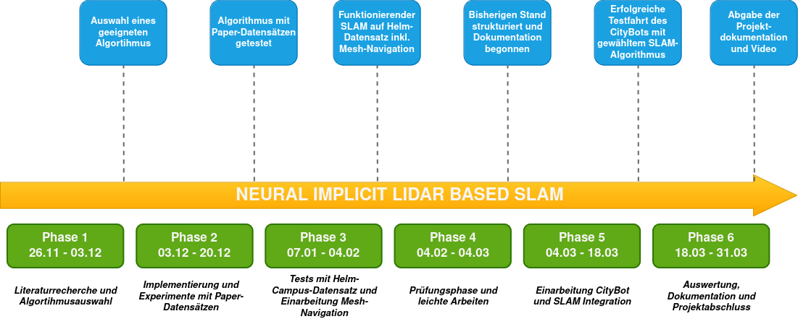

# Neural Implicit Lidar Based SLAM - Research Project

  

## Phasenübersicht

1. Literaturrecherche und Algorithmusauswahl (26.11 - 03.12)
2. Implementierung und Experimente mit Paper-Datensätzen (03.12 - 20.12)
3. Tests mit Helm-Campus-Datensatz und Mesh-Navigation (07.01 - 04.02)
4. Prüfungsphase und leichte Arbeiten (04.02 - ca. 04.03)
5. Einarbeitung CityBot und SLAM-Integration (04.03 - 18.03)
6. Auswertung und Dokumentation (18.03 - 31.03)

## Plan

### Phase 1: Literaturrecherche und Algorithmusauswahl (26.11 - 03.12)

### Ziel: 
Überblick über Neural Implicit Lidar SLAM gewinnen und den passenden Algorithmus auswählen.

### Arbeitspakete:
1. Literaturrecherche (8h)
    - Recherche, was es für Paper in diesem Bereich gibt.

2. Entscheidung für den Algorithmus (2h)
    - Auswahl eines geeigneten SLAM-Algorithmus basierend auf Literatur und Github-Repo.
    - Dokumentation der Wahl und Vorbereitung für Experimente.

#### Meilenstein: 
Auswahl eines geeigneten Algorithmus.

___________________________________

### Phase 2: Implementierung und Experimente mit Paper-Datensätzen (03.12 - 20.12)

### Ziel: 
Den gewählten Algorithmus mit Paper-Datensätzen testen und Überblick über den Code machen.

### Arbeitspakete:
1. Implementierung und Tests (15h)
    - Setup des gewählten SLAM-Algorithmus (z.B. PIN-SLAM).
    - Experimente mit Paper-Datensätzen aus der Veröffentlichung oder den jeweiligen Repositories.

2. Erste Analyse der Ergebnisse (5h)
    - Analyse der SLAM-Ergebnisse und Meshes.
    - Identifikation von Stärken und Schwächen.

#### Meilenstein:
Algorithmus erfolgreich mit Paper-Datensätzen getestet und erste Erkenntnisse gesammelt.

___________________________________

### Phase 3: Tests mit eigenen Datensätzen und Mesh-Navigation (07.01 - 04.02)

### Ziel: 
Den Algorithmus auf den Helm-Campus-Datensatz anwenden, Ergebnisse analysieren und auf Basis des generierten Meshes navigieren.

### Arbeitspakete:
1. Vorbereitung eigener Daten (8h)
    - Verarbeitung des Helm-Aufnahme-Datensatzes (Lidar- und Kameradaten).
    - Sicherstellen, dass die Daten für den Algorithmus geeignet sind.
    - Ggf. Preprocessing-Skripte schreiben.

2. Algorithmustests mit eigenen Daten (12h)
    - Anwendung des SLAM-Algorithmus auf den Helm-Campus-Datensatz.
    - Vergleich der generierten Meshes mit den Ergebnissen der Autoren-Datensätze.

3. Mesh-Navigation aus generierten Mesh (10h)
    - Einarbeitung in Repo für Mesh-Navigation (z.B. https://github.com/naturerobots/mesh_navigation)
    - Navigation auf Basis des generierten Meshes simulieren.

#### Meilenstein:
Funktionierende Anwendung des SLAM-Algorithmus auf den Helm-Campus-Datensatz inkl. laufender Mesh-Navigation.

#### First Experimental Results

___________________________________

### Phase 4: Prüfungsphase und leichte Arbeiten (04.02 - ca. 04.03, je nach Klausurterminen)

### Ziel: 
Dokumentationsentwurf und kleiner Fortschritt trotz Prüfungen.

### Arbeitspakete:
1. Hausmeistern (5h)
    - bisherigen Code aufräumen
    - README(s) für Installation, Setup, Ausführung, usw. schreiben

2. Zwischenanalyse (5h)
    - Bewertung der Ergebnisse und Identifikation von Verbesserungsmöglichkeiten.

3. Beginn der Dokumentation (5h)
    - Grober Entwurf für die Dokumentation (Methodik, erste Ergebnisse).

#### Meilenstein:
Bisherigen Stand strukturiert festgehalten und Dokumentation begonnen.

___________________________________

### Phase 5: Einarbeitung CityBot und SLAM-Integration (04.03 - 18.03)

### Ziel: 

### Arbeitspakete:
1. Einarbeitung in CityBot und Steuerung (15h)
    - Analyse der bestehenden CityBot-Infrastruktur (Steuerungssoftware, Sensorik).
    - Relevante Schnittstellen identifizieren.

2. SLAM-Integration in CityBot (20h)
    - Anpassung des SLAM-Algorithus an die Infrastruktur des CityBots.

3. Mesh-Navigation-Integration in CityBot (15h)
    - Integration des Mesh-Navigation-Algorithmus in CityBot Code.

#### Meilenstein:
Erfolgreiche Testfahrt des CityBots mit SLAM und Mesh-Navigation.

___________________________________

### Phase 6: Auswertung und Dokumentation (18.03 - 31.03)

### Ziel: 
Finalisierung des Algorithmus, Ergebnisse auswerten und Projektdokumentation abschließen.

### Arbeitspakete:
1. Finalisierung des Algorithmus (3h)
    - READMEs schreiben
    - Code und Setup-Scripts fertigstellen

2. Auswertung und Analyse (5h)
    - Analyse der generierten Meshes + Navigation aus der Testfahrt
    - Schlussfolgerungen zur Qualität des Algorithmus.

3. Finale Dokumentation (12h)
    - Vollständige Dokumentation der Methodik, Experimente und Ergebnisse.
    - Erstellung eines Videos für Überblick über Projekt.

#### Meilenstein:
Abgabe der Projektdokumentation bis Ende März.

___________________________________

### Links:
- https://github.com/PRBonn/PIN_SLAM
- https://github.com/naturerobots/mesh_navigation
- https://github.com/naturerobots/mesh_navigation_tutorials