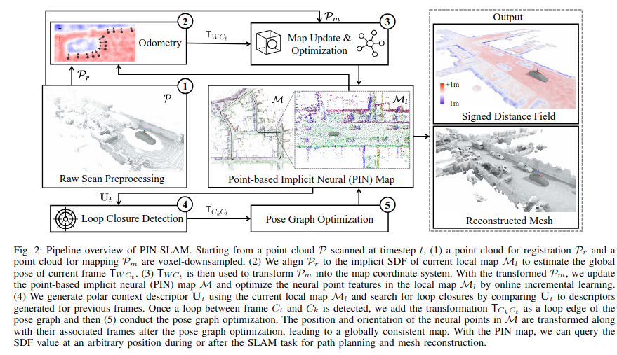

# Literature Research

### Awesome Survey Paper on NeRF- and 3DGS-SLAM
How NeRFs and 3D Gaussian Splatting are Reshaping SLAM: a Survey (https://arxiv.org/pdf/2402.13255)

---
 
**Goal**: Generate dense, smooth maps of the environment using sparse LiDAR data.

---

### **Notes Papers**

#### **1. NeRF-LOAM**
- **Core Components**:
  1. **Neural Odometry**: Estimates 6-DoF pose by minimizing SDF errors.
  2. **Neural Mapping**: Uses dynamic voxel embeddings in an octree, focusing on areas with rich geometry.
  3. **Mesh Reconstruction**: Reconstructs meshes from the map.
- **Notes**:
  - Octree-based architecture for efficient memory usage.
  - Key-scan refinement to prevent catastrophic forgetting.  
- **Input**: LiDAR Depth data.
- **Link**: [NeRF-LOAM](https://openaccess.thecvf.com/content/ICCV2023/papers/Deng_NeRF-LOAM_Neural_Implicit_Representation_for_Large-Scale_Incremental_LiDAR_Odometry_and_ICCV_2023_paper.pdf)

---

#### **2. LONER**
- **Core Components**:
  1. **Tracking**: Processes scans with ICP for odometry estimation.
  2. **Mapping**: Updates neural scene representation using keyframes.
- **Notes**:
  - Hierarchical encoding of scene geometry.
  - Dynamic Margin Loss: Combines depth, sky, and Jensen-Shannon losses for different types of regions.
- **Input**: LiDAR Depth data.
- **Link**: [LONER](https://ieeexplore.ieee.org/stamp/stamp.jsp?arnumber=10284988)

---

#### **3. PIN-SLAM**
- **Core Components**:
  1. **Point-Based Implicit Neural Map Representation**:
   - Elastic Neural Points: Sparse, optimizable, and deformable points representing geometry.
   - Voxel Hashing: Efficient indexing for real-time performance.
  2. **Implicit Surface Representation**:
    - Encodes the environment as SDFs.
    - Supports correspondence-free registration for odometry and loop closure.
  3. **Pose Graph**:
    - Integrates odometry and loop closure transformations to refine trajectory and map consistency.
- **Notes**:
  - Real-time performance via voxel hashing and neural point indexing.
  - Loop closure detection with polar context descriptors.
  - Compact map representation suitable for accurate mesh reconstruction.
  - Dynamic-Point-Filterting filters out redundant/irrelevant points.
  - Correspondence-free-point-to-implicit model-registration.
- **Input**: LiDAR Depth data and optionally RGB-D.
- **Link**: [PIN-SLAM](https://arxiv.org/pdf/2401.09101)

---

### **Comparison Overview**

| **Aspect**                | **NeRF-LOAM**        | **LONER**             | **PIN-SLAM**          |
|---------------------------|----------------------|-----------------------|-----------------------|
| **Scene Encoding**        | Octree Grid + MLP   | Hierarchical Grid + MLP | Neural Points + MLP  |
| **Geometry Representation** | SDF                | Density               | SDF                  |
| **Input Modalities**       | Depth              | Depth                | RGB-D, Depth         |
| **Loop Closure**           | ✗                  | ✗                    | ✓                    |
| **Object Segmentation**    | ✗                  | ✗                    | ✓                    |
| **Frame-to-Model Alignment** | ✓                  | ✗                    | ✓                    |
| **Frame-to-Frame Alignment** | ✗                  | ✓                    | ✗                    |

---

### **Performance Evaluation Summary of Survey Paper**
Note: PIN-LO is the PIN-SLAM version with disabled loop closure detection correction and pose graph optimization module.

#### **1. KITTI**
- **Odometry**:  
  - **PIN-LO**: Outperforms others with 0.5% translation error.
  - **PIN-SLAM**: Consistently better trajectory accuracy (1.1 m RMSE with loop closure).  
- **Mapping**:  
  - **PIN-SLAM**: Superior 3D reconstruction accuracy and completeness.

#### **2. Newer College**
- **Tracking**:  
  - **PIN-SLAM**: ATE RMSE of 0.19 cm (5× lower than PIN-LO).  
- **Mapping**:  
  - **PIN-SLAM**: 7 cm better completeness on Quad sequence compared to NeRF-LOAM.

#### **Speed and Memory Efficiency**
- PIN-SLAM seems to be much more efficient than NeRF-LOAM with 7 GB of GPU running at 7 FPS
- NeRF-LOAM requires 12 GB while running with 4 FPS
- Still quite slow

---

### **Other Interesting Papers**
- **LIV-Gauss-Map**: Gaussian-based LiDAR SLAM ([IEEE Link](https://ieeexplore.ieee.org/stamp/stamp.jsp?arnumber=10529285)).
- **MM-Gaussian**: Advanced Gaussian models for mapping ([arXiv Link](https://arxiv.org/pdf/2404.04026)).

---

### **Datasets Used**
1. **KITTI**: LiDAR odometry and mapping (42k stereo pairs, 22 LiDAR scan sequences). [Dataset Link](https://www.cvlibs.net/datasets/kitti/)
2. **Newer College**: Real-world dataset with rich geometry (2.2 km walk). [Paper Link](https://arxiv.org/pdf/ori.ox.ac.uk/datasets/newer-college-dataset)

---

### **PIN-SLAM: Point-Based Implicit Neural SLAM**
PIN-SLAM introduces a novel SLAM system leveraging a **Point-Based Implicit Neural (PIN) Map Representation**, enabling online large-scale, globally consistent mapping with loop closure. It integrates odometry, loop closure detection, and implicit neural mapping, all optimized for real-time performance on commodity hardware.

---

### **Key Contributions**
1. **Localization Accuracy**: Achieves state-of-the-art localization performance, outperforming recent implicit neural SLAM methods across diverse datasets and sensors.
2. **Globally Consistent Mapping**: Supports large-scale mapping with **loop closure detection** and **elastic neural point representation** to ensure global consistency.
3. **Compact Map Representation**: Enables reconstruction of accurate and detailed meshes at arbitrary resolutions using a more compact representation compared to prior methods.
4. **Real-Time Efficiency**: Achieves real-time operation via:
   - **Correspondence-Free Scan-to-Implicit Map Registration**.
   - **Efficient Neural Point Indexing** through voxel hashing.
   - Runs at sensor frame rates on an NVIDIA A4000 GPU.

---

## PIN-SLAM more detailed information
  

### **Pipeline Overview**
1. **Preprocessing**:
   - Input point cloud P is voxel-downsampled into:
     - $P_r$: Point cloud for registration.
     - $P_m$: Point cloud for mapping.

2. **Odometry**:
   - Registers $P_r$ to the implicit SDF of the current **local map $M_l$** to estimate the global pose.
   - Adds odometry transformation as an edge in the **pose graph $G$**.

3. **Mapping**:
   - Filters dynamic points in $P_m$ using the global map $M$.
   - Samples along rays from the sensor to each point in $P_m$, generating training samples $D$.
   - Initializes new neural points with close-to-surface samples $D_s\subset D$.
   - Updates neural point features in $M_l$ using gradient descent with direct SDF supervision.
   - Reallocates the updated $M_l$ back into the global map $M$.

4. **Loop Closure Detection**:
   - Generates a **local polar context descriptor** $U_t$ from $M_l$.
   - Searches for loop closures by comparing feature distances between $U_t$ and descriptors of previous frames.
   - Verifies loop closure candidates by registering $P_r$ to the local map $M_l$ centered at the candidate frame’s position.
   - Adds successful loop closure transformations as edges in the pose graph G.

5. **Pose Graph Optimization**:
   - Optimizes G after adding loop closure edges.
   - Updates the position and orientation of neural points in $M$ to maintain global consistency.
   - Transforms the training sample pool $D_p$ and resets $M_l$ following loop correction.

6. **Mesh Reconstruction**:
   - Queries SDF values at arbitrary positions for mesh generation during or post-SLAM using the **Marching Cubes Algorithm**.

### **Use Cases**
- **Path Planning**: SDF values can be queried for robot navigation.
- **3D Reconstruction**: Enables high-resolution mesh reconstruction for visualization and analysis.

